Hello Everyone!  Welcome to my github!  My name is Harry, and yes I know I am late to this github party, but better late than never!
I'm trying to break into the world of IT, the Cybersecurity Sector, and since the competition is fierce out there I need to show what I am made of.

I love to learn new things, and I want to break into cybersecurity but so far I'm on the outside looking in, but that is subject to change.
I have certficiates in the following:

✅ CompTIA Security+

✅ CompTIA Network+

📜 Certification of Cybersecurity from Minnesota University

And last but not least Studying AZ-900, Linux and Splunk

I created this portfolio to showcase my future hands-on projects, labs, and write-ups as I try to further my career in the cybersecurity field.

📫 Contact Me

- LinkedIn: https://www.linkedin.com/in/harry-roldan/

- Email: harry.roldan@gmail.com

- [▶️ My New Linux video Labs](https://youtu.be/CmdONew5Utw)

- [▶️ Let's Linux: Episode 2 - cd, pwd, touch, mkdir, ls](https://youtu.be/PD2AaqqCs5A)

## 🐧 Linux Basics First Linux Lab (LabEx)

### Objective
Starting my Linux refresher journey.
Learned: echo, id, uid, gid, groups, apt, sudo, install

### What I did?
I started using Labex to start this journey, and so far the hands on labs have been useful.

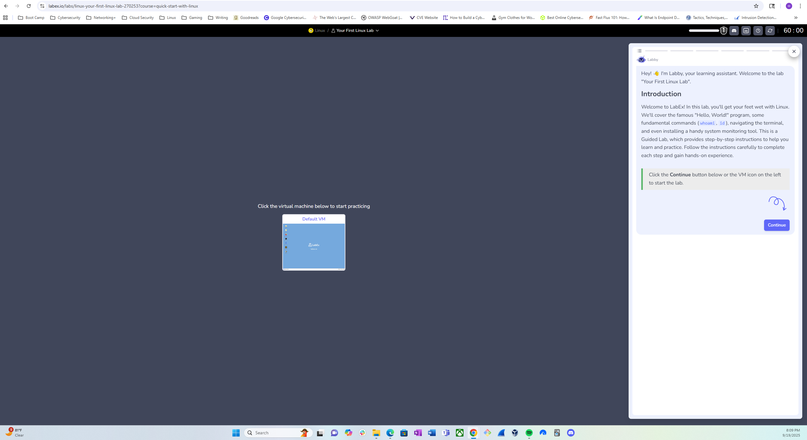

## Learning id and echo

These two commands were a refresher for me.  As you can see from the picture below I used echo to repeat my input.  
***id*** I used to see who the groups that I belonged to.  It was very basic, but it is something that is very important.

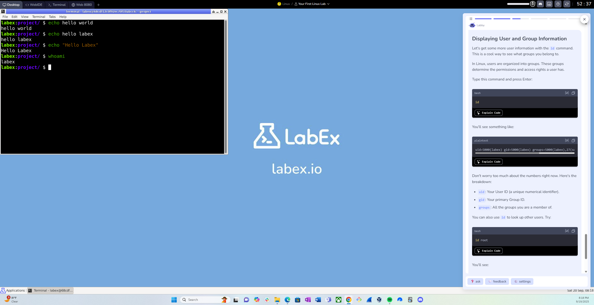

below you will see that once I used the command <id> it showed  the 
***uid>*** which is the user ID 
***gid*** Your primary group ID
***groups*** All the groups that a user is a member of.

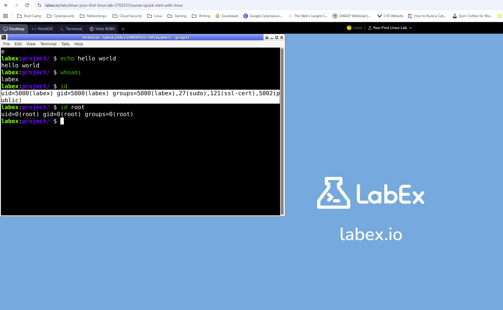

What good is this information if you don't know what it means?  So, I highlighted the uid, gid and groups area of the above image.  
And you can see the number 5000 after each portion.  So what does the number 5000 indicate or mean?  Well the number '0' indicates the user is the
root user, who has super privileges on the system and can do almost anything.  In most Linux systems numbers 1-999 are reserved for system accounts and 
services.  And numbers 1000-5000 are for regular users on the system. 

## 🐧 Second Linux Lab pwd, ls, and cd LabEx 

In my second Lab I am refreshing with more basic commands.  I remembered all of them expcet one that I didn't learn.  So let us get started!
the first command is pwd (print working directory).  What this does is it shows the users current location within the system.  BUT there is one command that
I didn't know about and it was the ~ (tilde symbol).  This is a quick travel back to the users home directory, which I found out to be very neat!  Take a look at the image below!

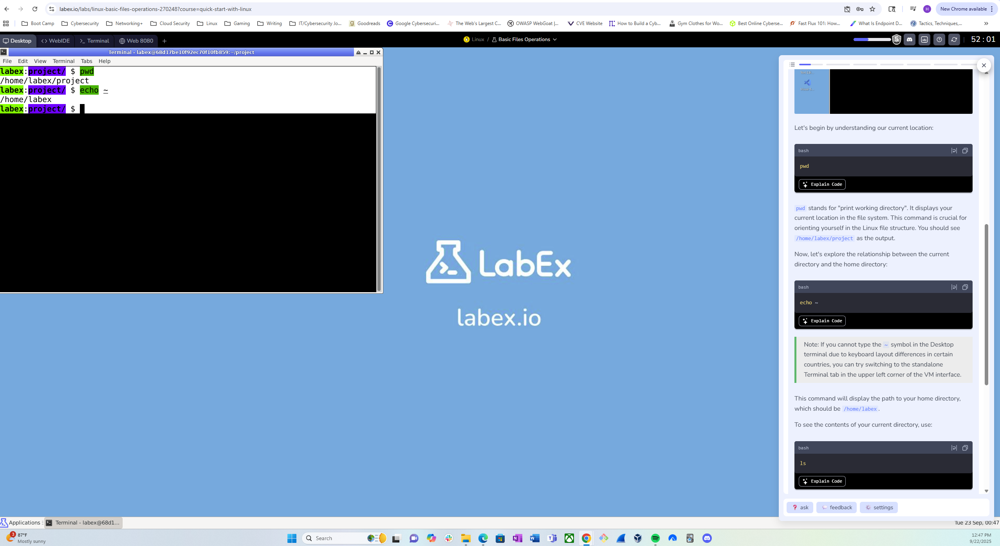

When I put the pwd command it shows the path of /home/labex/prject
BUT when I use command echo ~ it throws me to the home directory directly.

The next command is **ls(list)**.  This command is one of the most common commands and I remember using this all the time while at my bootcamp a few years ago.  This command list the contents of the 
directory that user is currently in.  As you can see below I used the 'ls' command in the project folder but that folder was empty, but when I used the **'ls ~'** command it shows the home directory and all
the directories aka folders within the my home directory. 

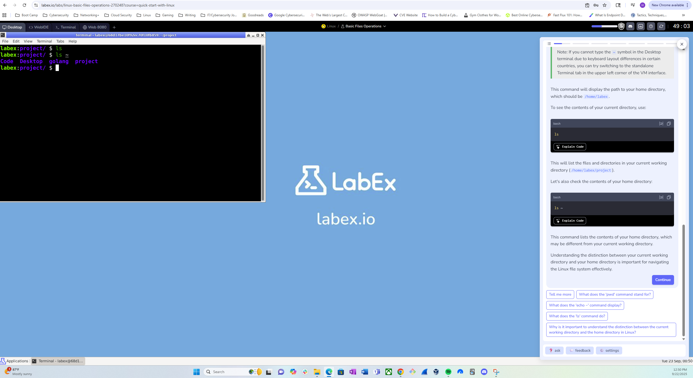

After reaquanting myself with the ***ls(list)*** command, I moved on to the ***cd(change directory)*** command. After going into the home directory, I would like to naviage to the project diretory within it.  But how do you we do that?
Oh, let me show you!  the command would be ***cd project*** and that will throw you into the project folder.

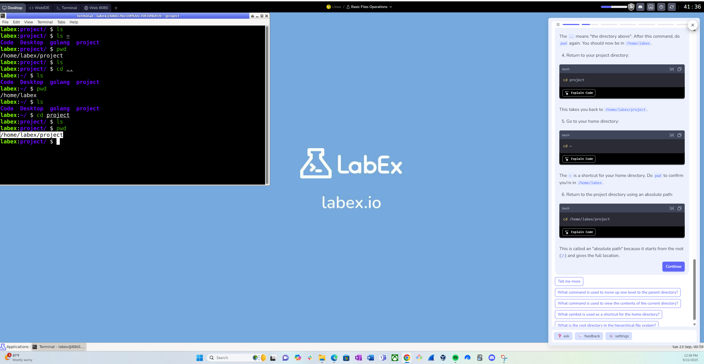

A few more things that I refreshed on were the ***.. and the ../..*** and what an absoulte path is.  
the ***..*** is to go up a level or go up a directory to the parent directory.  the ***../..*** means the user can go up two levels.  This is saves time if you are going down a rabbit hole of information or
directories on a system.

And last not least ***absoulte path***  This is the exact path that one will take to get to a directory.  In the image below I want to get to the project folder.  I can easily ***cd*** the project folder which would take several steps, or I can use the
absolute path, which is this in the below example:  ***cd /home/labex/project*** it is a bit longer but it will get you directly there!

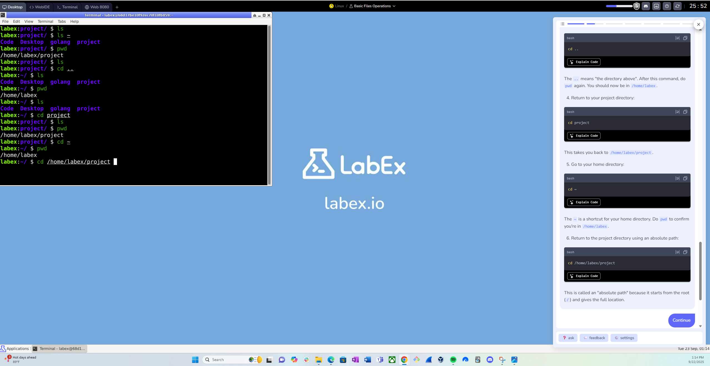

## 🐧 Third Linux Lab Let's create, copy and make files shall we

In today's lesson I'm going to refresh my knowledge on a few commands.  The ***touch, cp and the mkdir*** commands!

So let's start with the ***touch*** command.  No we aren't touching anything but creating something.  The touch command is used to create a file that has nothing in it.  What I forogt was the ***.*** is a way to create a hidden file!  I'm going to use the echo command and use this syntax ***echo "Hello, Linux" > file.txt*** and when a user uses the command ***ls*** it will not show up on the listing of files and directories!  Didn't really know that and I found that so cool to learn. 

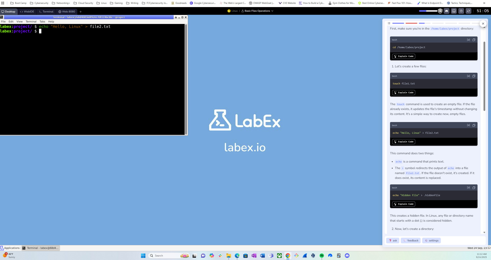

A few things to look at as well is the ***> and >>*** symbols while creating directories and files.  So let me get to it!  The **>** when in use creates and overwrites whatever file or directory you the user are writing to.  **BUT** the **>>** adds more content to whatever directory or file that you are writing to.  A user must be careful while using these outputs! I would say thank you for coming to my Linux Talks, but I have more!

Now I'm going to make a directory using the ***mkdir*** command.  In the example beolow I am creating a directory with the command and syntax ***mkdir testdir*** after creating something I was taught to always check your work, which is very good advice.  So in the example below it shows just that. 

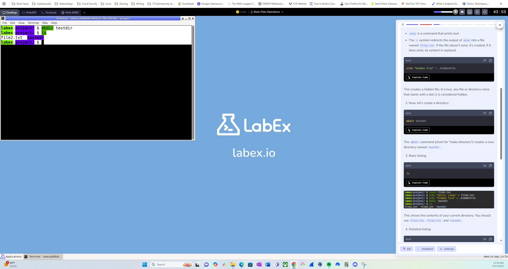

After I created the directory and used the ***ls*** command I did a little tinkering because I like having my listings vertically not horizontally, after researching I found this command ***ls -1*** that is the number one not the letter l, to list thing vertically.  Like so...

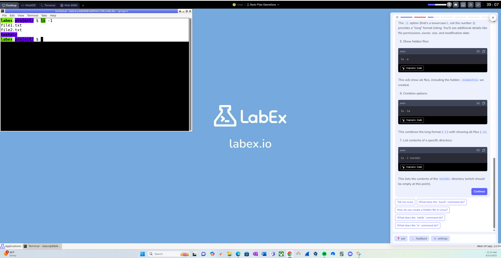

And If the user types out the command with ***ls -1*** followed by the file or directory it will show detailed information about the file, like the permissions per file like ***red, write, and execute***

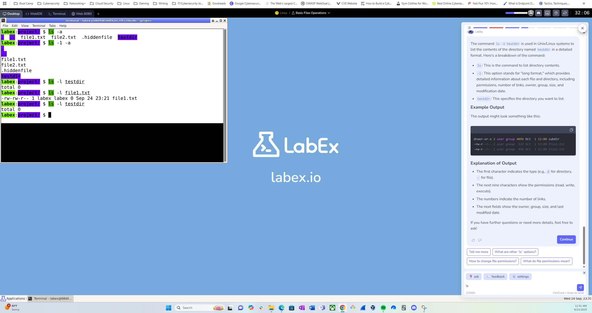

  
